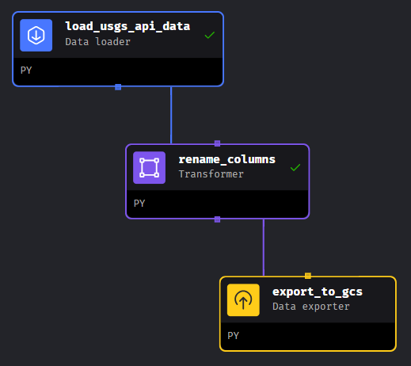
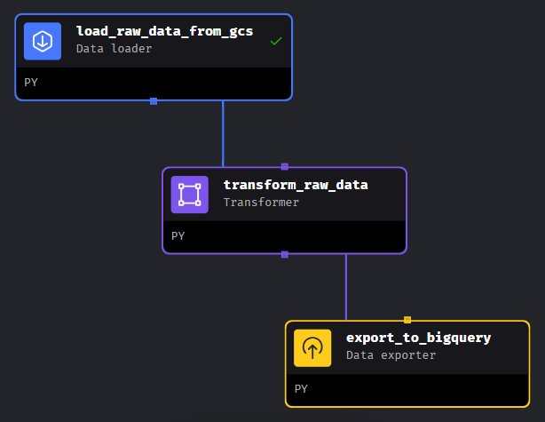

# Earthquake Data Engineering Project

## Problem Description
The goal of this project was to construct data pipelines for extracting records of seismic events within a particular time period, transform the data and present the processed data to consumer in the visually descriptive form.

The project involved the following steps:
- Creating a batch pipeline for extracting data from API and putting it to a datalake
- Creating a batch pipeline for loading the data from the lake, transforming it and putting the transformed data to a data warehouse
- Building a dashboard to visualize the transformed data
- Deploying the pipeline system to cloud

## Dataset
The data used for the project was extracted from [USGS Earthquake Catalog](https://earthquake.usgs.gov/fdsnws/event/1/), which provides records of registered seismic events containing their time, location, magnitude, etc. The raw data was extracted in `.csv` format (see 
[sample API data](sample_api_data.csv)).

For this project, the time period was limited to 2020-01-01 - current date.

See [dataset description](Dataset_description.md) for more info on the contents of the dataset.

## Architecture and Technologies
Below is the diagram of the project architecture:

Technologies used for the project:
- **Cloud**: GCP
- **Infrastructure as code (IaC)**: Terraform
- **Workflow orchestration**: Mage
- **Data warehouse**: BigQuery
- **Data lake**: Google Cloud Storage
- **Project development**: Google Compute Engine
- **Visualization**: Looker Studio

## Pipelines
There are two ETL pipelines in this project. Both have been developed and are orchestrated with Mage.ai. See `mage/` folder for all the scripts.

### 1. `eq_api_to_gcs`

This pipeline consists of the following blocks:
- **Data loader**: loads the data from USGS EC API considering the query limits and assignes the datatypes
- **Transformer**: renames all columns to `snake_case`
- **Data exporter**: exports raw data in `.parquet` format partitioned by year and month to GCS bucket

The pipeline is scheduled to run daily at 07:00am UTC. The time period for which the data is loaded is defined by runtime variables (2020-01-01 and current date by default).

### 2. `eq_gcs_to_bigquery_transformed`

This pipeline picks up from the first one and consists of the following blocks:
- **Data loader**: loads the partitioned raw data from GCS and combines it into a single table 
- **Transformer**: filters data to earthquake events only, assigns categories based on magnitude, combines latitude and longitude columns into coordinates column, drops unnecessary columns (primarily data sources), deletes specific null and duplicate records
- **Data exporter**: exports transformed data to BigQuery table 

The pipeline is scheduled to run daily at 08:00am UTC. The time period for which the data is loaded is defined by runtime variables (2020-01-01 and current date by default).

## Dashboard
You can view the interactive dashboard built on the basis of the transformed data here:
https://lookerstudio.google.com/embed/reporting/38203211-e3df-4fc3-86ef-0da0c9d8c3a6/page/AbgwD

## Setup
See [instructions](Setup_instructions.md) for local and cloud setup.

## Improvements
There are some improvements that can be done in the future:
- Perform the transformations in the second pipeline directly in the warehouse with dbt, which is more efficient.
- Convert the standard batch pipeline to data integration, so that only the changed records are updated. 

## Acknowledgements
This project was developed as a final project for the Data Engineering Zoomcamp by DataTalks.Club:
https://github.com/DataTalksClub/data-engineering-zoomcamp
