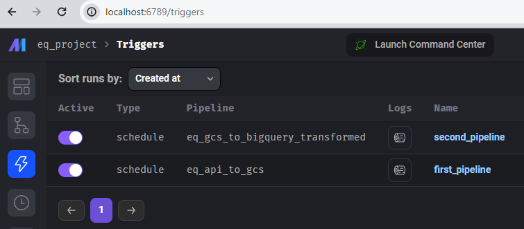

# Setup Instructions
This document describes how to run the project locally and in the cloud.

## Local setup

### 0. Prerequisites
- Docker and Docker Compose
- Google Cloud Platform account

### 1. Clone the project from repository
```
git clone https://github.com/ValeryKarnevich/earthquake-data-engineering.git \
&& cd earthquake-data-engineering/mage \
&& cp dev.env .env && rm dev.env \
```

### 2. Create GCP service account
In Google Cloud Platform, navigate to IAM & Admin -> Service Accounts, and create a new service accout with roles:
- BigQuery Admin
- Storage Admin
- Storage Object Admin

Alternatively, select specific roles, which enable to read and write data to Google Cloud Storage and BigQuery.

Then, navigate to Keys and create new key for this service account. Download the key in `.json` format. Save the key file as `key.json` in `earthquake-data-engineering/mage` folder.

### 3. Open Mage
In `earthquake-data-engineering/mage` folder, run:
```
docker compose up
```
Open http://localhost:6789 in your browser.

### 4. Trigger the pipelines
Navigate to eq_project/Triggers in Mage UI or open http://localhost:6789/triggers, then toggle on both pipelines, as seen below:



This will activate the pipelines to run daily according to the schedule. 

Alternatively, you may navigate to eq_project/Pipelines in Mage UI or open http://localhost:6789/pipelines, then run each pipeline individually.

## Cloud setup

### 0. Prerequisites
- Terraform
- Google Cloud Platform account
- Google Cloud SDK

### 1. Update GCP service account
Go to the IAM management dashboard, find the service account associated to the account you are logged into with, and then add these roles to that service account (e.g. choose your account as the principal when adding new roles):
- Artifact Registry Read
- Artifact Registry Writer
- Cloud Run Developer
- Cloud SQL
- Service Account Token Creator

### 2. Log into GCP from CLI
From your terminal run the following commands:
```
gcloud init
```
```
gcloud auth application-default login
```
And follow the instructions to authenticate.

### 3. Customize Terraform settings
Clone the project as per step 1 of Local setup.

Сhange the default value of the variable named `project_id` in the `earthquake-data-engineering/terraform/variables.tf` file to your GCP project ID.
```
variable "project_id" {
  type        = string
  description = "The name of the project"
  default     = "unique-gcp-project-id"
}
```

### 4. Deploy Mage with Terraform
Navigate to Terraform folder:
```
cd earthquake-data-engineering/terraform
```
Initialize Terraform:
```
terraform init
```
Check resources that will be created:
```
terraform plan
```
Deploy:
```
terraform apply
```

### 5. Open Mage in Google Run
After Terraform finishes, it will output an IP address for connection. Open a browser and go to http://[IP_address]. 

### 6. Configure Github in Mage
With your Github account, create a new repository with the contents of the `earthquake-data-engineering/mage/eq_project` folder.

In Mage UI, go to Version Control and authenticate your Github account.

In Git init directory, specify `/home/src/eq_project`.

In Remotes, add a new remote with the Github repository you just created.

In Actions, choose Clone and the remote you just added and perform cloning.

### 7. Final steps
If the project does not appear in Mage UI, edit the `/home/src/.env` file via the Mage terminal to have `PROJECT_NAME=eq_project`.

Create a new GCP service account as per step 2 of Local setup and put the `key.json` file in the `/home/src` directory.

Trigger the pipelines as per step 4 of Local setup.